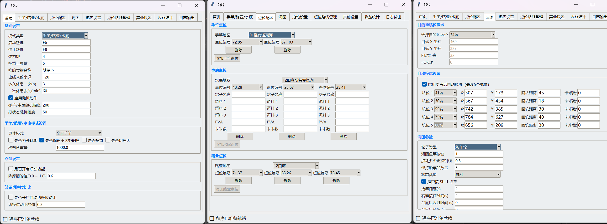
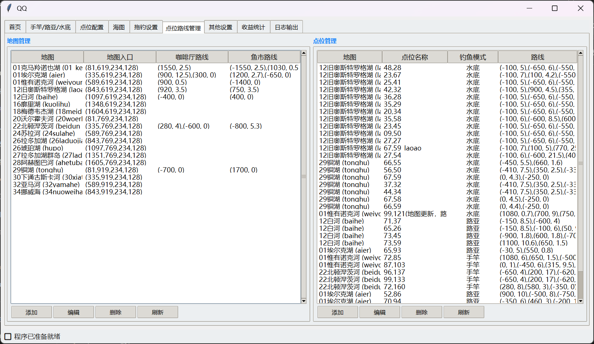

# 俄罗斯钓鱼 4 全自动钓鱼脚本（RF4_Script）

《俄罗斯钓鱼 4》游戏的自动化辅助工具：图形化配置界面，支持多种钓鱼方式与常用日常操作（导航、抛竿、收鱼、切鱼、卖鱼、任务等）。

>本项目基于[[RussianFishing4-Script]](https://github.com/fyodorrss/RussianFishing4-Script) 项目二次开发修复，为避免倒卖，本项目只提供编译文件。

## 功能概览

### 手竿 / 水底 / 路亚
- 自动寻路到目标点位（含咖啡厅任务、卖鱼流程等）
- 自动抛竿与收鱼
- 自动修复损坏/咬断的钓组
- 定时换点（规避小时口）
- 昼夜切换策略（白天路亚/夜间水底等）
- 自动打窝（手抛/部分 PVA；具体以界面选项为准）
- 切不达标的鱼为鱼肉

### 海图（搬砖/深坑/拖钓等）
- 自动寻路、自动钓鱼、自动换坑/回坑
- 自动续费/补票、自动更换引线/鱼饵（可选）
- 自动切鱼片（可选）
- 电轮/鼓轮传动比切换

### 其他
- 可自定义点位及路线,
- 体力补给、自动小退、随机动作等辅助能力
- 日志记录：每天一个日志文件（`logs/YYYY-MM-DD.log`）

## 环境要求

- 系统：Windows
- 分辨率：仅支持 `1920x1080`（桌面与游戏分辨率需一致）
- 游戏显示：全屏 / 无边框窗口
- 游戏语言/界面：以简体中文环境为主（识别素材与配置依赖）
- 建议在虚拟机使用

## 配置与数据文件

- `config.json`：主要配置（由程序生成）
- `position.json`：点位/路线相关数据,现有的点位数据只有一部分并且没有完全测试和更新，欢迎大家一起贡献和编辑点位路线数据。

## 注意事项
- 首次启动需等待一定时间。
- 脚本运行期间，**请勿随意干扰**脚本操作。
- 避免长时间挂机，建议配合手动操作。
- 本脚本为自动化辅助工具，使用者需自行承担使用风险。
- 本项目为非商用项目，禁止用于任何形式的收费或商业用途。

## 常见问题

- 识别不准/点不动：确认分辨率为 `1920x1080`，并使用全屏/无边框；画质建议调低、视野调到最大，关闭上鱼动画。
- 程序无响应：首次加载 OCR/模型可能较慢，查看 `logs/` 日志定位卡在哪里。
- 操作异常：运行期间尽量不要手动干预鼠标键盘；如果需要手动操作，建议先停止脚本。

## 项目地址与反馈

- 项目地址：[https://github.com/lzsforge/RF4_Script/](https://github.com/lzsforge/RF4_Script/)
- qq群：698688180

提交问题建议附上：系统环境、分辨率、日志文件、复现步骤与截图。

## 免责声明

本项目为自动化辅助工具，仅供学习与技术交流使用。使用者需自行承担使用风险。
